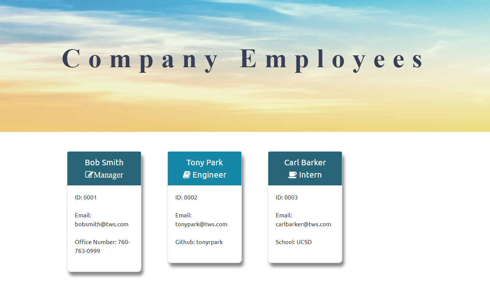
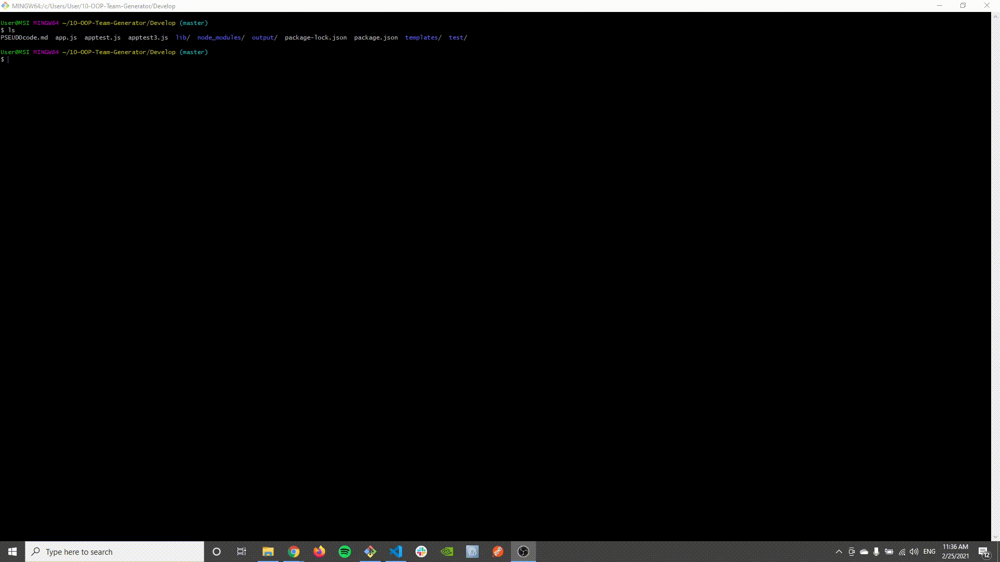

1. Screenshot of Final Product
   
2. GIF of Team Generator
   
3. GIF of Passing Test
   

# Main files:

1. Develop/output/employees.html
2. Develop/output/styles.css
3. Develop/output/generateHTML.js
4. Develop/app.js

---

## Major Elements

- Use of Inquirer and switch-case in order to ask user questions in logical manner
- Tie-In of 'app.js', 'package.json', 'generateHTML.js', 'employees.html', and test cases

### Installation and Setup

- Node.Js must be installed
- Dependencies in the 'package-json' must be installed with an 'npm i {NAME OF DEPENDENCY}'
- Run 'node app.js' to run inquirer prompt
- Run 'npm test' to make sure code works

© Tony Park 2021
